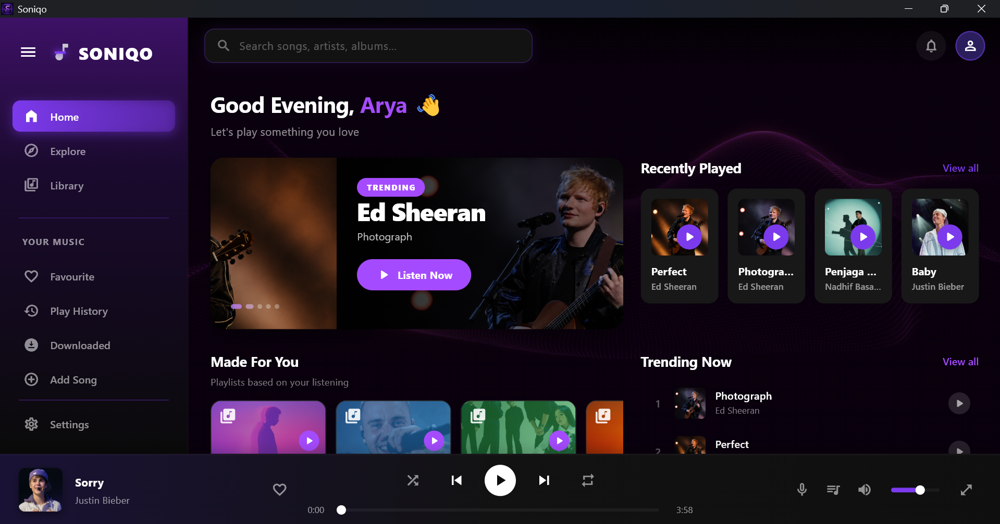
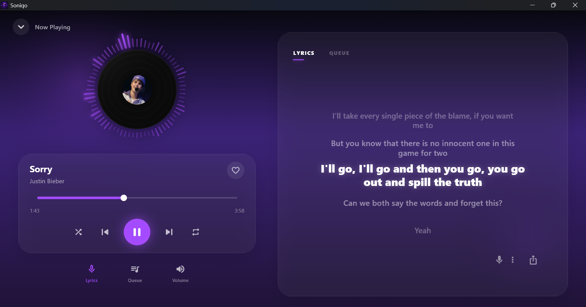
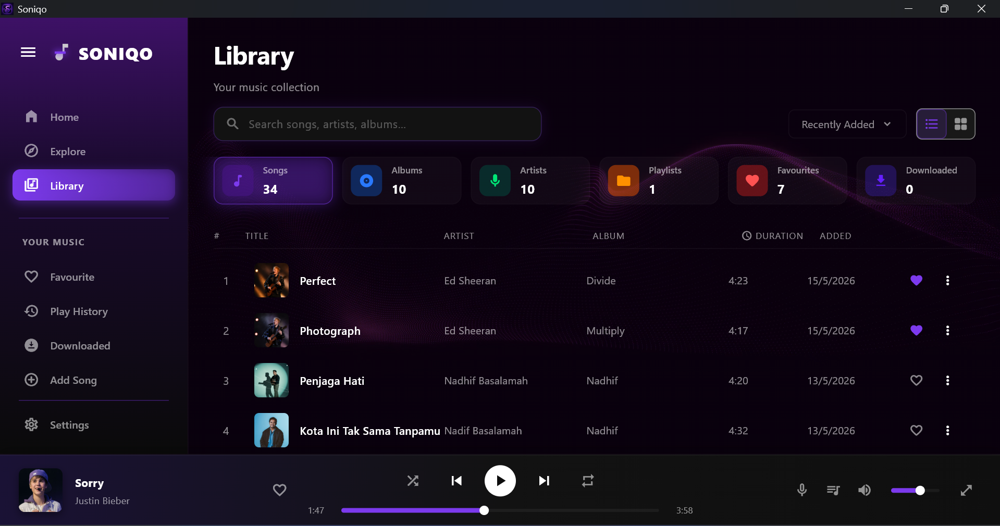
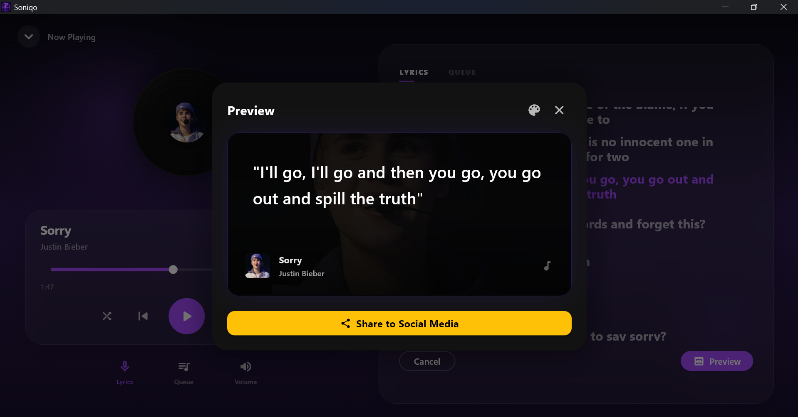

# 🎵 Soniqo

Soniqo adalah aplikasi desktop music player yang dikembangkan menggunakan Flutter dengan dukungan tampilan lirik karaoke, playlist, dan manajemen musik dalam antarmuka modern.

## 📸 Screenshots

### 🏠 Home



### 🎤 Karaoke Lyrics



### 📚 Library



### 📤 Share Lyrics



## ✨ Features

- 🎶 Memutar file musik lokal
- 🎤 Tampilan lirik karaoke
- 📂 Manajemen playlist
- 🖼️ Dukungan album artwork
- 🔍 Pencarian lagu
- 📤 Berbagi lirik
- 💻 Antarmuka desktop modern

## 🛠️ Built With

- Flutter
- Dart
- Windows Desktop

## 📁 Project Structure

```text
lib/
├── widgets/
├── models/
├── services/
└── main.dart

assets/
windows/
test/
```

## 🚀 Getting Started

Clone repository:

```bash
git clone https://github.com/arya-yoga-pratama/soniqo.git
```

Masuk ke folder project:

```bash
cd soniqo
```

Install dependencies:

```bash
flutter pub get
```

Jalankan aplikasi:

```bash
flutter run
```

## 🎯 Project Goal

Soniqo dibuat sebagai proyek pengembangan aplikasi desktop berbasis Flutter yang berfokus pada pengalaman mendengarkan musik dengan dukungan tampilan lirik karaoke yang interaktif.

## 👨‍💻 Author

**Arya Yoga Pratama**

GitHub:
https://github.com/arya-yoga-pratama

---

⭐ Jika project ini bermanfaat, jangan lupa berikan star pada repository.
